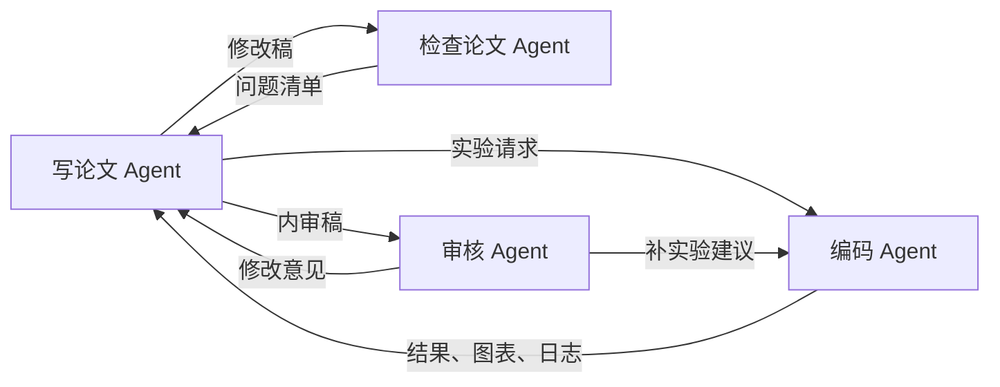

# 论文 Agent 协作流程

目标是通过明确交接和可追溯证据，把作者材料逐步整理为可进入投稿准备的稿件。各角色先读取 [README.md](README.md) 中的项目变量。本文所有路径相对于 `PROJECT_ROOT`。

## 初始化

1. 确认作者授权范围、项目目录、工作稿、代码、数据和目标期刊。
2. 读取现有内容，保留原始输入；建立 `logs/project_status.md`，列明研究问题、证据清单、限制和待解决事项。
3. 将研究主张映射到来源、实验或分析；缺失证据明确标为待完成。

## 每轮迭代

1. 写论文 Agent 更新研究主线，并把有必要的实验请求保存到 `experiments/requests/round_XX.md`。
2. 编码 Agent 执行约定实验，保存配置、日志、机器可读结果、图表及给作者的解释。
3. 写论文 Agent 根据已验证的结果修订稿件，记录新增主张及其依据。
4. 检查论文 Agent 检查一致性和证据完整性，把发现保存到 `review/checks/`。
5. 写论文 Agent 处理检查项，将剩余限制明确带入内审。
6. 审核 Agent 将决策和下一轮条件保存到 `review/decisions/`。
7. 更新 `logs/project_status.md` 与 `logs/revision_log.md`，按条件进入下一轮或投稿准备。

## 交接规则

- 每项任务写明责任角色、输入、输出路径、验收标准和依赖。
- 并行工作时，一个角色拥有某个文件的写入权；其他角色通过报告或建议交接修改，避免同时覆盖。
- 图表或结果更新后，同步检查正文数字、标题、单位、引用与结论。
- 有编译流程的项目按已有入口构建并核对引用；成功且审查完成的改动按项目约定保存版本。
- 未达到条件时记录具体缺口与下一步；若受数据、权限、预算或算力限制，说明需要什么输入，不无限重复相同实验。
- 内审达到 `Ready for submission preparation` 后，由作者决定是否投稿；不自动公开研究内容。

## 优先级

先解决核心方法、代码、数据和正文不一致，再补充支撑关键主张的证据，然后完善贡献与讨论，最后进行语言和版式修订。所有优先级根据实际证据调整，不预设稿件已经存在某类错误。
